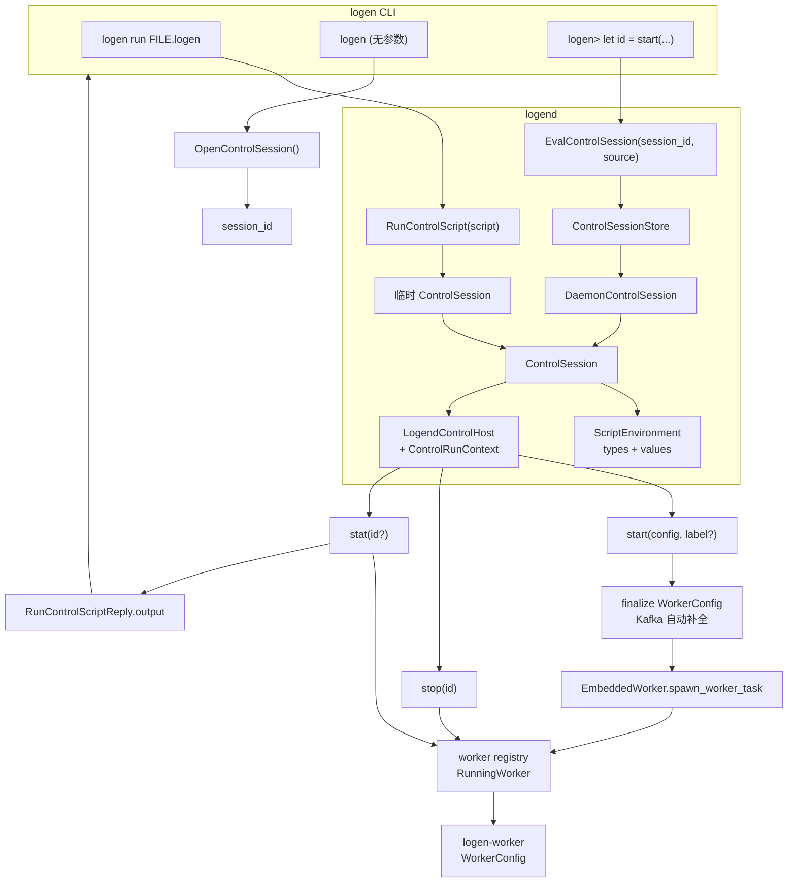

```mermaid
 flowchart TD
    subgraph cli["logen CLI"]
      file["logen run FILE.logen"]
      shell["logen (无参数)"]
      line["logen> let id = start(...)"]
    end
    file --> runRpc["RunControlScript(script)"]
    shell --> openRpc["OpenControlSession()"]
    openRpc --> sessionId["session_id"]
    line --> evalRpc["EvalControlSession(session_id, source)"]
    subgraph daemon["logend"]
      runRpc --> oneShot["临时 ControlSession"]
      evalRpc --> store["ControlSessionStore"]
      store --> daemonSession["DaemonControlSession"]
      daemonSession --> savedSession["ControlSession"]
      oneShot --> savedSession
      savedSession --> env["ScriptEnvironment\ntypes + values"]
      savedSession --> host["LogendControlHost\n+ ControlRunContext"]
    end
    host --> startBuiltin["start(config, label?)"]
    host --> stopBuiltin["stop(id)"]
    host --> statBuiltin["stat(id?)"]
    startBuiltin --> finalize["finalize WorkerConfig\nKafka 自动补全"]
    finalize --> spawn["EmbeddedWorker.spawn_worker_task"]
    spawn --> registry["worker registry\nRunningWorker"]
    registry --> worker["logen-worker\nWorkerConfig"]
    stopBuiltin --> registry
    statBuiltin --> registry
    statBuiltin --> output["RunControlScriptReply.output"]
    output --> cli
```